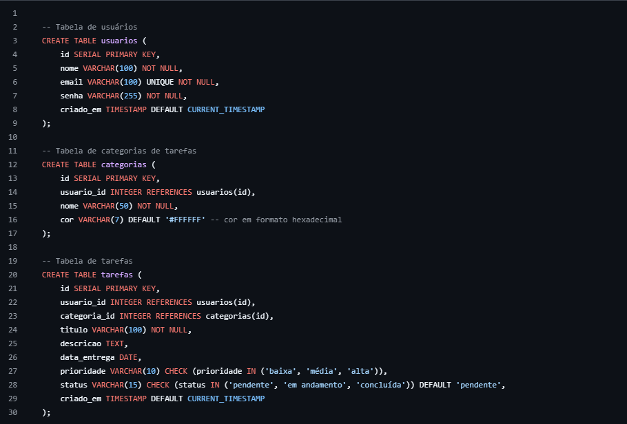
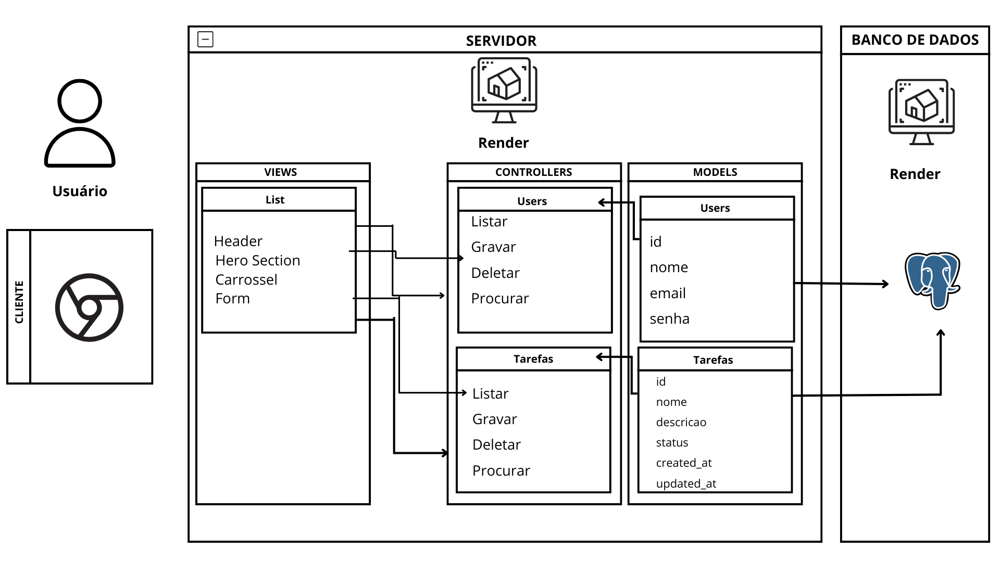

# Web Application Document - Projeto Individual - Módulo 2 - Inteli

## 🗓️ UniPlanner

#### Mariana Pereira de Souza 

## Sumário

1. [Introdução](#c1)  
2. [Visão Geral da Aplicação Web](#c2)  
3. [Projeto Técnico da Aplicação Web](#c3)  
4. [Desenvolvimento da Aplicação Web](#c4)  
5. [Referências](#c5)  

<br>

## <a name="c1"></a>1. Introdução (Semana 01)

O UniPlanner é um sistema web desenvolvido para ajudar estudantes universitários a gerenciar suas tarefas acadêmicas e pessoais. O objetivo principal é fornecer uma ferramenta simples e intuitiva para organizar atividades diárias, otimizar o tempo de estudo e aumentar a produtividade.

O sistema permitirá que os usuários cadastrem tarefas, as classifiquem por categoria (como estudos, trabalho, lazer, etc.), e definam prazos e prioridades. Cada tarefa terá um status (pendente, em andamento ou concluída), e o estudante poderá acompanhar o progresso em tempo real. Além disso, o UniPlanner contará com um painel que exibirá uma visão geral das tarefas, com a possibilidade de filtrá-las por data, categoria e prioridade.

A interface será simples e eficiente, focada em facilitar a experiência do usuário, com recursos de usabilidade como drag-and-drop para reordenar tarefas e lembretes. O sistema também terá uma seção de relatórios, permitindo que os estudantes acompanhem seu desempenho e o tempo gasto em cada categoria de tarefa.

O UniPlanner será composto por três principais componentes: Frontend (interface de interação do usuário), Backend (lógica de negócios e API), e Banco de Dados (armazenamento das tarefas e dados dos usuários). O objetivo é que o UniPlanner seja uma ferramenta essencial para estudantes que desejam organizar suas rotinas acadêmicas de forma eficiente, alcançando um equilíbrio entre estudos e vida pessoal.

---

## <a name="c2"></a>2. Visão Geral da Aplicação Web

### 2.1. Personas (Semana 01 - opcional)


Uma **persona** é uma representação fictícia de um usuário ideal do sistema, baseada em dados reais, comportamentos, motivações e objetivos. Ela ajuda a orientar o desenvolvimento de soluções mais eficazes, centradas nas necessidades reais dos usuários. Ao criar personas, desenvolvedores e designers conseguem tomar decisões mais assertivas em relação à experiência de uso e funcionalidades da aplicação.

#### 🎯 Persona no contexto do UniPlanner

No projeto **UniPlanner**, as personas foram criadas com base em perfis comuns de estudantes universitários que enfrentam desafios para manter a organização da rotina acadêmica. Elas foram pensadas para guiar o desenvolvimento do sistema, garantindo que a solução atenda às principais dores, necessidades e expectativas desses usuários.


<div align="center">
<sub> Figura x - Persona 1 </sub>

</div>

<div align="center">
<sub> Figura x - Persona 2 </sub>

</div>

<div align="center">
<sub> Figura x - Persona 3 </sub>

</div>


### 2.2. User Stories (Semana 01 - opcional)

### US01 — Cadastro e Autenticação de Usuários

| Identificação        | US01                                                                                         |
|----------------------|----------------------------------------------------------------------------------------------|
| Persona              | Mariana Andrade                                                                              |
| User Story           | Como estudante universitária, quero criar uma conta e fazer login no UniPlanner para acessar e gerenciar minhas tarefas pessoais e acadêmicas. |
| Critério de aceite 1 | O sistema deve permitir o cadastro com nome, e-mail e senha.                                 |
| Critério de aceite 2 | O sistema deve permitir login com e-mail e senha.                                            |
| Critério de aceite 3 | Deve haver feedback visual para erros de autenticação (ex: senha incorreta).                 |
| Critérios INVEST     | _**Independente**_: Não depende de outras funcionalidades.                                  |
|                      | _**Negociável**_: Campos e validações podem ser ajustados.                                  |
|                      | _**Valoroso**_: Permite acesso individual ao sistema e dados pessoais.                      |
|                      | _**Estimável**_: Pode ser estimado em horas de desenvolvimento.                             |
|                      | _**Small**_: Pode ser dividido entre backend e frontend.                                     |
|                      | _**Testável**_: Testável com login/cadastro válidos e inválidos.                             |


### US02 — Criação de Tarefas

| Identificação        | US02                                                                                         |
|----------------------|----------------------------------------------------------------------------------------------|
| Persona              | Lucas Ferreira                                                                               |
| User Story           | Como estudante multitarefas, quero poder adicionar tarefas com data, descrição e prioridade para organizar melhor meu tempo. |
| Critério de aceite 1 | O sistema deve permitir adicionar título, descrição, prazo e prioridade da tarefa.          |
| Critério de aceite 2 | A tarefa deve ser salva no banco de dados e exibida ao usuário.                             |
| Critério de aceite 3 | As tarefas devem ser listadas em ordem de prioridade ou data.                               |
| Critérios INVEST     | _**Independente**_: Não depende de outras funcionalidades.                                  |
|                      | _**Negociável**_: Campos podem ser ajustados.                                                |
|                      | _**Valoroso**_: Ajuda o usuário a manter o controle das atividades.                         |
|                      | _**Estimável**_: Pode ser estimado por desenvolvedor.                                       |
|                      | _**Small**_: Pode ser entregue em partes: interface, validação, banco.                      |
|                      | _**Testável**_: Deve permitir testes de criação e exibição de tarefas.                      |

### US03 — Visualização de Tarefas por Categoria

| Identificação        | US03                                                                                         |
|----------------------|----------------------------------------------------------------------------------------------|
| Persona              | Beatriz Souza                                                                                |
| User Story           | Como usuária do sistema, desejo visualizar minhas tarefas por categoria para segmentar entre tarefas pessoais e acadêmicas. |
| Critério de aceite 1 | O sistema deve permitir a filtragem de tarefas por categoria.                               |
| Critério de aceite 2 | Deve haver categorias predefinidas e a opção de criar novas.                                |
| Critério de aceite 3 | As tarefas filtradas devem ser exibidas com clareza e responsividade.                       |
| Critérios INVEST     | _**Independente**_: Pode ser implementado isoladamente.                                     |
|                      | _**Negociável**_: Layout e categorias podem ser ajustadas.                                  |
|                      | _**Valoroso**_: Facilita a organização visual e controle.                                   |
|                      | _**Estimável**_: Possível de estimar em tempo.                                              |
|                      | _**Small**_: Pode ser fracionado entre backend e frontend.                                  |
|                      | _**Testável**_: Filtragem pode ser testada com dados reais e simulados.                     |


### US04 — Edição e Exclusão de Tarefas

| Identificação        | US04                                                                                         |
|----------------------|----------------------------------------------------------------------------------------------|
| Persona              | Lucas Ferreira                                                                               |
| User Story           | Como estudante multitarefas, desejo poder editar ou excluir tarefas conforme minha rotina muda. |
| Critério de aceite 1 | O sistema deve permitir editar campos de tarefas já existentes.                             |
| Critério de aceite 2 | O sistema deve permitir excluir tarefas com confirmação do usuário.                         |
| Critério de aceite 3 | Após alterações, os dados devem ser atualizados no banco.                                   |
| Critérios INVEST     | _**Independente**_: Não requer outras funcionalidades.                                      |
|                      | _**Negociável**_: Funcionalidade pode ser simplificada.                                     |
|                      | _**Valoroso**_: Dá controle total sobre o planejamento.                                     |
|                      | _**Estimável**_: Fácil de planejar e implementar.                                           |
|                      | _**Small**_: Pode ser feito em pequenos componentes.                                        |
|                      | _**Testável**_: Testável com alteração e remoção de dados.                                  |


### US05 — Notificações de Prazos

| Identificação        | US05                                                                                         |
|----------------------|----------------------------------------------------------------------------------------------|
| Persona              | Mariana Andrade                                                                              |
| User Story           | Como estudante com dificuldade em lembrar prazos, desejo receber lembretes das tarefas para não perder prazos importantes. |
| Critério de aceite 1 | O sistema deve enviar notificações com base no prazo definido.                              |
| Critério de aceite 2 | O usuário deve poder ativar/desativar notificações.                                         |
| Critério de aceite 3 | As notificações devem ser enviadas com antecedência configurável.                           |
| Critérios INVEST     | _**Independente**_: Funciona separadamente do CRUD de tarefas.                              |
|                      | _**Negociável**_: Forma de notificação pode ser alterada.                                   |
|                      | _**Valoroso**_: Garante que o usuário cumpra prazos.                                        |
|                      | _**Estimável**_: Pode ser estimado com clareza.                                             |
|                      | _**Small**_: Pode ser dividido entre envio, controle e interface.                           |
|                      | _**Testável**_: Pode ser testado com tarefas simuladas.                                     |


## <a name="c3"></a>3. Projeto da Aplicação Web

### 3.1. Modelagem do banco de dados  (Semana 3)

Um banco de dados relacional é uma forma estruturada de armazenar e organizar informações em tabelas relacionadas entre si, permitindo fácil acesso, manutenção e integridade dos dados. Cada tabela representa uma entidade do sistema, e as relações entre elas são feitas por meio de chaves primárias e estrangeiras, o que facilita operações como busca, filtragem, atualização e exclusão de dados de forma eficiente.

Neste contexto, o modelo relacional apresentado tem como objetivo estruturar o banco de dados do projeto UniPlanner, um sistema web voltado à organização pessoal de estudantes universitários, por meio de um gerenciador de tarefas funcional e intuitivo. O modelo foi elaborado com foco em clareza, normalização e boas práticas de design de banco de dados, permitindo a evolução do sistema de forma escalável e confiável.

<div align="center">
<sub> Figura x - Modelagem banco de dados</sub>

</div>

<div align="center">
<sub> Figura x - Modelagem Física </sub>

</div>

📄 **Modelo Físico (Schema SQL):**  
[`documentos/modelo-fisico.sql`](modelo-fisico-simples.sql)

### 3.1.1 BD e Models (Semana 5)

No projeto **UniPlanner**, o banco de dados foi desenvolvido utilizando **PostgreSQL**, com foco em armazenar e organizar tarefas acadêmicas de forma prática e eficiente. O sistema segue a arquitetura MVC (Model-View-Controller), onde a camada **Model** é responsável por definir as estruturas de dados e interagir diretamente com o banco.

A biblioteca `pg` do Node.js foi utilizada para realizar as conexões e executar as queries, utilizando `async/await` para garantir operações assíncronas e seguras.


 Models implementados

 🔸 Model: Tarefa

Representa as tarefas que o usuário pode cadastrar no sistema. Cada tarefa inclui informações como título, descrição, status de andamento e datas de criação e modificação.

**Nome da tabela:** `tarefas`

**Campos:**

| Campo       | Tipo         | Descrição                                      |
|-------------|--------------|------------------------------------------------|
| id          | SERIAL       | Identificador único da tarefa (chave primária)|
| nome        | TEXT         | Nome/título da tarefa                          |
| descricao   | TEXT         | Descrição detalhada da tarefa                  |
| status      | TEXT         | Situação atual da tarefa (ex: pendente, em andamento, concluída) |
| created_at  | TIMESTAMP    | Data e hora em que a tarefa foi criada         |
| updated_at  | TIMESTAMP    | Data e hora da última atualização da tarefa    |


 **Estrutura SQL do Model**

```sql
CREATE TABLE tarefas (
  id SERIAL PRIMARY KEY,
  nome TEXT NOT NULL,
  descricao TEXT,
  status TEXT,
  created_at TIMESTAMP DEFAULT CURRENT_TIMESTAMP,
  updated_at TIMESTAMP
);
```

### 3.2. Arquitetura (Semana 5)

A arquitetura do projeto **UniPlanner** foi desenvolvida com base no padrão **MVC (Model-View-Controller)**, uma abordagem amplamente utilizada no desenvolvimento de aplicações web por promover a separação de responsabilidades. Essa estrutura facilita a manutenção do código, a escalabilidade do sistema e a organização geral do projeto.

No contexto do UniPlanner — um sistema de organização de tarefas acadêmicas — essa separação é fundamental para permitir que o frontend (interface) se comunique de forma eficiente com o backend (lógica e banco de dados), garantindo uma experiência fluida e funcional para o usuário.

<div align="center">
<sub> Figura x - Design de Arquitetura </sub>

</div>


 Componentes da Arquitetura

- **Model**: Responsável por lidar com a lógica de negócio e a comunicação direta com o banco de dados PostgreSQL. No UniPlanner, é onde são feitas as consultas SQL para inserir, listar, atualizar e excluir tarefas.
  
- **Controller**: Intermediário entre a View e o Model. Recebe as requisições HTTP (como criar ou listar tarefas), processa os dados (se necessário) e chama os métodos apropriados do Model. Após isso, retorna a resposta para a View ou API.
  
- **View**: Responsável por exibir a interface ao usuário, com páginas renderizadas em EJS. É nessa camada que o usuário interage com o sistema, como ao preencher formulários ou visualizar listas de tarefas.


Fluxo de Dados

1. O usuário interage com a **View** (ex: envia um formulário de nova tarefa).
2. A **Controller** recebe essa requisição, valida os dados e chama uma função no **Model**.
3. O **Model** realiza a operação no banco de dados (ex: `INSERT` ou `SELECT`).
4. O resultado é enviado de volta à **Controller**, que então redireciona ou renderiza uma nova **View** com os dados atualizados.

Esse fluxo garante que cada parte da aplicação tenha um papel claro e independente, seguindo os princípios do MVC.


A adoção da arquitetura MVC no projeto **UniPlanner** foi essencial para a organização do código e a divisão eficiente de responsabilidades. Ela permitiu que o sistema fosse desenvolvido de forma modular, onde alterações na interface (View) não afetam diretamente a lógica (Model), e vice-versa. Esse padrão torna o UniPlanner mais fácil de manter, escalar e compreender por qualquer outro desenvolvedor que venha a colaborar no projeto.

### 3.3. Wireframes (Semana 03 - opcional)

*Posicione aqui as imagens do wireframe construído para sua solução e, opcionalmente, o link para acesso (mantenha o link sempre público para visualização).*

### 3.4. Guia de estilos (Semana 05 - opcional)

*Descreva aqui orientações gerais para o leitor sobre como utilizar os componentes do guia de estilos de sua solução.*


### 3.5. Protótipo de alta fidelidade (Semana 05 - opcional)

*Posicione aqui algumas imagens demonstrativas de seu protótipo de alta fidelidade e o link para acesso ao protótipo completo (mantenha o link sempre público para visualização).*

### 3.6. WebAPI e endpoints (Semana 05)

A WebAPI do **UniPlanner** foi desenvolvida utilizando a arquitetura RESTful, permitindo que aplicações clientes (como o frontend, ou ferramentas como o Insomnia e Postman) realizem requisições HTTP para manipular os dados da aplicação. Cada funcionalidade principal do sistema é exposta através de **endpoints**, que seguem padrões claros de rota, método e formato de dados.

No contexto do UniPlanner, esses endpoints são responsáveis por gerenciar as **tarefas** que os usuários cadastram, visualizam, atualizam e excluem. Os dados são trafegados em formato **JSON**, e o backend interage com o banco de dados PostgreSQL utilizando **consultas SQL puras com a biblioteca `pg`** do Node.js.

Esses endpoints representam a **camada de Controller** da arquitetura MVC, servindo como ponte entre o banco de dados (Model) e a interface (View).

A seguir, a descrição detalhada de cada endpoint implementado na API:

### 🔹 POST /tarefas

**Descrição:** Cria uma nova tarefa no sistema.

**Corpo da requisição (JSON):**

```json
{
  "nome": "Estudar Banco de Dados",
  "descricao": "Revisar comandos SQL e relacionamento entre tabelas"
}
```
Resposta de sucesso (201 Created):

```json
{
  "id": 1,
  "nome": "Estudar Banco de Dados",
  "descricao": "Revisar comandos SQL e relacionamento entre tabelas",
  "status": null,
  "created_at": "2025-05-20T15:00:00.000Z",
  "updated_at": null
}
```
### 🔹  GET /tarefas

**Descrição:** Retorna a lista de todas as tarefas cadastradas no sistema.

**Resposta de sucesso (200 OK):**

```json

[
  {
    "id": 1,
    "nome": "Estudar Banco de Dados",
    "descricao": "Revisar comandos SQL e relacionamento entre tabelas",
    "status": null,
    "created_at": "2025-05-20T15:00:00.000Z",
    "updated_at": null
  }
]
```
### 🔹  PUT /tarefas/:id

**Descrição:** Atualiza uma tarefa existente com base no id informado.

**Parâmetros de rota:**
- id: ID da tarefa a ser atualizada.

**Corpo da requisição (JSON):**
```json

{
  "nome": "Estudar Banco de Dados - Aula 5",
  "descricao": "Praticar relacionamentos no Supabase",
  "status": "em andamento"
}

```
**Resposta de sucesso (200 OK):**
```json

{
  "id": 1,
  "nome": "Estudar Banco de Dados - Aula 5",
  "descricao": "Praticar relacionamentos no Supabase",
  "status": "em andamento",
  "created_at": "2025-05-20T15:00:00.000Z",
  "updated_at": "2025-05-21T10:30:00.000Z"
}

```
**Erros possíveis:**
- 404 Not Found: Caso o ID não corresponda a nenhuma tarefa existente.

### 🔹  DELETE /tarefas/:id

**Descrição:** Exclui uma tarefa existente com base no id.

**Parâmetros de rota:**
- id: ID da tarefa que será excluída.

**Resposta de sucesso (200 OK):**
```json
{
  "message": "Tarefa excluída com sucesso"
}
```
**Considerações Finais**
Todos os endpoints acima utilizam o banco de dados PostgreSQL por meio da biblioteca pg com async/await para execução de queries, garantindo um desempenho assíncrono e seguro.

Os dados são enviados e recebidos no formato JSON, permitindo uma integração simples com qualquer frontend ou ferramenta de testes.

Essa API representa a camada de Controller da arquitetura MVC, intermediando a interação entre o banco de dados (Model) e as interfaces que consomem os dados (View).

### 3.7 Interface e Navegação (Semana 07)

*Descreva e ilustre aqui o desenvolvimento do frontend do sistema web, explicando brevemente o que foi entregue em termos de código e sistema. Utilize prints de tela para ilustrar.*

---

## <a name="c4"></a>4. Desenvolvimento da Aplicação Web (Semana 8)

### 4.1 Demonstração do Sistema Web (Semana 8)

*VIDEO: Insira o link do vídeo demonstrativo nesta seção*
*Descreva e ilustre aqui o desenvolvimento do sistema web completo, explicando brevemente o que foi entregue em termos de código e sistema. Utilize prints de tela para ilustrar.*

### 4.2 Conclusões e Trabalhos Futuros (Semana 8)

*Indique pontos fortes e pontos a melhorar de maneira geral.*
*Relacione também quaisquer outras ideias que você tenha para melhorias futuras.*


## <a name="c5"></a>5. Referências

_Incluir as principais referências de seu projeto, para que o leitor possa consultar caso ele se interessar em aprofundar._<br>

---
---
