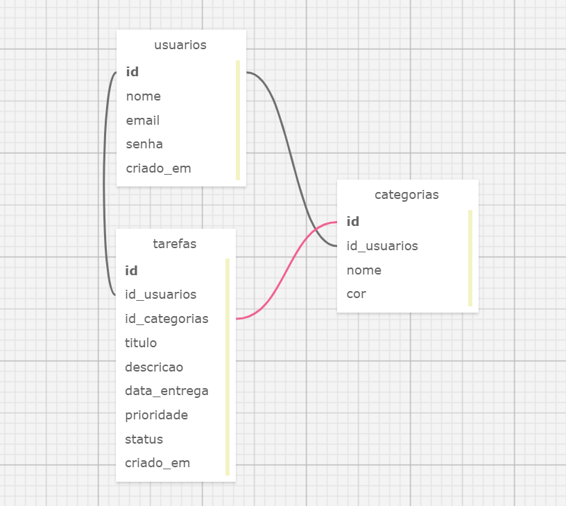

# Web Application Document - Projeto Individual - Módulo 2 - Inteli

## 🗓️ UniPlanner

#### Mariana Pereira de Souza 

## Sumário

1. [Introdução](#c1)  
2. [Visão Geral da Aplicação Web](#c2)  
3. [Projeto Técnico da Aplicação Web](#c3)  
4. [Desenvolvimento da Aplicação Web](#c4)  
5. [Referências](#c5)  

 

## 1. Introdução (Semana 01)

O UniPlanner é um sistema web desenvolvido para ajudar estudantes universitários a gerenciar suas tarefas acadêmicas e pessoais. O objetivo principal é fornecer uma ferramenta simples e intuitiva para organizar atividades diárias, otimizar o tempo de estudo e aumentar a produtividade.

O sistema permitirá que os usuários cadastrem tarefas, as classifiquem por categoria (como estudos, trabalho, lazer, etc.), e definam prazos e prioridades. Cada tarefa terá um status (pendente, em andamento ou concluída), e o estudante poderá acompanhar o progresso em tempo real. Além disso, o UniPlanner contará com um painel que exibirá uma visão geral das tarefas, com a possibilidade de filtrá-las por data, categoria e prioridade.

A interface será simples e eficiente, focada em facilitar a experiência do usuário, com recursos de usabilidade como drag-and-drop para reordenar tarefas e lembretes. O sistema também terá uma seção de relatórios, permitindo que os estudantes acompanhem seu desempenho e o tempo gasto em cada categoria de tarefa.

O UniPlanner será composto por três principais componentes: Frontend (interface de interação do usuário), Backend (lógica de negócios e API), e Banco de Dados (armazenamento das tarefas e dados dos usuários). O objetivo é que o UniPlanner seja uma ferramenta essencial para estudantes que desejam organizar suas rotinas acadêmicas de forma eficiente, alcançando um equilíbrio entre estudos e vida pessoal.

---

## 2. Visão Geral da Aplicação Web

### 2.1. Personas (Semana 01 - opcional)

## 👤 Personas

### 👩 Mariana Andrade
- **Idade:** 18 anos  
- **Mora em:** Belo Horizonte - MG  
- **Profissão:** Estudante universitária  
- **Educação:** Ensino Superior (em andamento)  
- **Formação:** Engenharia de Software (1º período)  
- **Status:** Solteira  
- **Hobby:** Maratonar séries e jogar online  
- **Personalidade:** Proativa, ansiosa e conectada  

**🗣️ Frase que a representa:**  
_"Preciso de algo que me ajude a lembrar de tudo sem surtar."_

**📌 Biografia:**  
Mariana acabou de ingressar na faculdade e ainda está se adaptando à vida universitária. Tem dificuldades com organização e prazos, pois tenta conciliar estudos, vida social e autocuidado. Sente-se sobrecarregada com tantas tarefas e atividades.

**🎯 Necessidades e Expectativas:**  
Precisa de uma ferramenta intuitiva para organizar suas tarefas, prazos e compromissos. Espera lembretes úteis e categorização clara das tarefas.

**🔥 Motivações:**  
Deseja se destacar na faculdade e organizar sua rotina para ter tempo livre com tranquilidade.

**💢 Pontos de dor:**  
Esquecimento de prazos, sobrecarga de tarefas, ansiedade por acúmulo de atividades.

### 👨 Lucas Ferreira
- **Idade:** 24 anos  
- **Mora em:** São Paulo - SP  
- **Profissão:** Estagiário de TI  
- **Educação:** Ensino Superior (em andamento)  
- **Formação:** Ciência da Computação (7º período)  
- **Status:** Namorando  
- **Hobby:** Programar e jogar RPG de mesa  
- **Personalidade:** Focado, metódico, prático  

**🗣️ Frase que o representa:**  
_"Tudo tem seu tempo, é só saber planejar."_

**📌 Biografia:**  
Lucas trabalha durante o dia e estuda à noite. É muito organizado e gosta de ter tudo sob controle. Usa agendas e apps para manter sua produtividade. Acredita que ferramentas digitais podem otimizar sua rotina.

**🎯 Necessidades e Expectativas:**  
Quer um sistema que seja rápido, funcional e que integre facilmente suas tarefas de trabalho e estudos.

**🔥 Motivações:**  
Busca melhorar sua produtividade e não esquecer compromissos importantes.

**💢 Pontos de dor:**  
Sente-se frustrado com ferramentas lentas ou desorganizadas. Perde tempo com tarefas manuais repetitivas.

### 👩 Beatriz Souza
- **Idade:** 21 anos  
- **Mora em:** Recife - PE  
- **Profissão:** Estudante de Design Gráfico  
- **Educação:** Ensino Superior (em andamento)  
- **Formação:** Design Gráfico (5º período)  
- **Status:** Solteira  
- **Hobby:** Desenhar e editar vídeos  
- **Personalidade:** Criativa, sensível, organizada visualmente  

**🗣️ Frase que a representa:**  
_"Se não for visual, não funciona pra mim!"_

**📌 Biografia:**  
Beatriz tem facilidade com arte e design, mas dificuldades em lidar com organização textual e prazos. Precisa de uma ferramenta com apelo visual que estimule sua criatividade e facilite a visualização das tarefas.

**🎯 Necessidades e Expectativas:**  
Busca uma interface clara, com cores e categorias visuais para se orientar melhor nas atividades diárias.

**🔥 Motivações:**  
Quer equilibrar prazos com projetos criativos e manter a produtividade sem abrir mão de sua linguagem visual.

**💢 Pontos de dor:**  
Ferramentas sem apelo visual ou com excesso de texto. Perde foco com interfaces desorganizadas.

---

### 2.2. User Stories (Semana 01 - opcional)

### US01 — Cadastro e Autenticação de Usuários

| Identificação        | US01                                                                                         |
|----------------------|----------------------------------------------------------------------------------------------|
| Persona              | Mariana Andrade                                                                              |
| User Story           | Como estudante universitária, quero criar uma conta e fazer login no UniPlanner para acessar e gerenciar minhas tarefas pessoais e acadêmicas. |
| Critério de aceite 1 | O sistema deve permitir o cadastro com nome, e-mail e senha.                                 |
| Critério de aceite 2 | O sistema deve permitir login com e-mail e senha.                                            |
| Critério de aceite 3 | Deve haver feedback visual para erros de autenticação (ex: senha incorreta).                 |
| Critérios INVEST     | _**Independente**_: Não depende de outras funcionalidades.                                  |
|                      | _**Negociável**_: Campos e validações podem ser ajustados.                                  |
|                      | _**Valoroso**_: Permite acesso individual ao sistema e dados pessoais.                      |
|                      | _**Estimável**_: Pode ser estimado em horas de desenvolvimento.                             |
|                      | _**Small**_: Pode ser dividido entre backend e frontend.                                     |
|                      | _**Testável**_: Testável com login/cadastro válidos e inválidos.                             |

---

### US02 — Criação de Tarefas

| Identificação        | US02                                                                                         |
|----------------------|----------------------------------------------------------------------------------------------|
| Persona              | Lucas Ferreira                                                                               |
| User Story           | Como estudante multitarefas, quero poder adicionar tarefas com data, descrição e prioridade para organizar melhor meu tempo. |
| Critério de aceite 1 | O sistema deve permitir adicionar título, descrição, prazo e prioridade da tarefa.          |
| Critério de aceite 2 | A tarefa deve ser salva no banco de dados e exibida ao usuário.                             |
| Critério de aceite 3 | As tarefas devem ser listadas em ordem de prioridade ou data.                               |
| Critérios INVEST     | _**Independente**_: Não depende de outras funcionalidades.                                  |
|                      | _**Negociável**_: Campos podem ser ajustados.                                                |
|                      | _**Valoroso**_: Ajuda o usuário a manter o controle das atividades.                         |
|                      | _**Estimável**_: Pode ser estimado por desenvolvedor.                                       |
|                      | _**Small**_: Pode ser entregue em partes: interface, validação, banco.                      |
|                      | _**Testável**_: Deve permitir testes de criação e exibição de tarefas.                      |

---

### US03 — Visualização de Tarefas por Categoria

| Identificação        | US03                                                                                         |
|----------------------|----------------------------------------------------------------------------------------------|
| Persona              | Beatriz Souza                                                                                |
| User Story           | Como usuária do sistema, desejo visualizar minhas tarefas por categoria para segmentar entre tarefas pessoais e acadêmicas. |
| Critério de aceite 1 | O sistema deve permitir a filtragem de tarefas por categoria.                               |
| Critério de aceite 2 | Deve haver categorias predefinidas e a opção de criar novas.                                |
| Critério de aceite 3 | As tarefas filtradas devem ser exibidas com clareza e responsividade.                       |
| Critérios INVEST     | _**Independente**_: Pode ser implementado isoladamente.                                     |
|                      | _**Negociável**_: Layout e categorias podem ser ajustadas.                                  |
|                      | _**Valoroso**_: Facilita a organização visual e controle.                                   |
|                      | _**Estimável**_: Possível de estimar em tempo.                                              |
|                      | _**Small**_: Pode ser fracionado entre backend e frontend.                                  |
|                      | _**Testável**_: Filtragem pode ser testada com dados reais e simulados.                     |

---

### US04 — Edição e Exclusão de Tarefas

| Identificação        | US04                                                                                         |
|----------------------|----------------------------------------------------------------------------------------------|
| Persona              | Lucas Ferreira                                                                               |
| User Story           | Como estudante multitarefas, desejo poder editar ou excluir tarefas conforme minha rotina muda. |
| Critério de aceite 1 | O sistema deve permitir editar campos de tarefas já existentes.                             |
| Critério de aceite 2 | O sistema deve permitir excluir tarefas com confirmação do usuário.                         |
| Critério de aceite 3 | Após alterações, os dados devem ser atualizados no banco.                                   |
| Critérios INVEST     | _**Independente**_: Não requer outras funcionalidades.                                      |
|                      | _**Negociável**_: Funcionalidade pode ser simplificada.                                     |
|                      | _**Valoroso**_: Dá controle total sobre o planejamento.                                     |
|                      | _**Estimável**_: Fácil de planejar e implementar.                                           |
|                      | _**Small**_: Pode ser feito em pequenos componentes.                                        |
|                      | _**Testável**_: Testável com alteração e remoção de dados.                                  |

---

### US05 — Notificações de Prazos

| Identificação        | US05                                                                                         |
|----------------------|----------------------------------------------------------------------------------------------|
| Persona              | Mariana Andrade                                                                              |
| User Story           | Como estudante com dificuldade em lembrar prazos, desejo receber lembretes das tarefas para não perder prazos importantes. |
| Critério de aceite 1 | O sistema deve enviar notificações com base no prazo definido.                              |
| Critério de aceite 2 | O usuário deve poder ativar/desativar notificações.                                         |
| Critério de aceite 3 | As notificações devem ser enviadas com antecedência configurável.                           |
| Critérios INVEST     | _**Independente**_: Funciona separadamente do CRUD de tarefas.                              |
|                      | _**Negociável**_: Forma de notificação pode ser alterada.                                   |
|                      | _**Valoroso**_: Garante que o usuário cumpra prazos.                                        |
|                      | _**Estimável**_: Pode ser estimado com clareza.                                             |
|                      | _**Small**_: Pode ser dividido entre envio, controle e interface.                           |
|                      | _**Testável**_: Pode ser testado com tarefas simuladas.                                     |

---

## 3. Projeto da Aplicação Web

### 3.1. Modelagem do banco de dados  (Semana 3)

Um banco de dados relacional é uma forma estruturada de armazenar e organizar informações em tabelas relacionadas entre si, permitindo fácil acesso, manutenção e integridade dos dados. Cada tabela representa uma entidade do sistema, e as relações entre elas são feitas por meio de chaves primárias e estrangeiras, o que facilita operações como busca, filtragem, atualização e exclusão de dados de forma eficiente.

Neste contexto, o modelo relacional apresentado tem como objetivo estruturar o banco de dados do projeto UniPlanner, um sistema web voltado à organização pessoal de estudantes universitários, por meio de um gerenciador de tarefas funcional e intuitivo. O modelo foi elaborado com foco em clareza, normalização e boas práticas de design de banco de dados, permitindo a evolução do sistema de forma escalável e confiável.

 Figura x - Modelagem banco de dados

'''

📄 **Modelo Físico (Schema SQL):**  
[`documentos/modelo-fisico.sql`](modelo-fisico-simples.sql)

### 3.1.1 BD e Models (Semana 5)
*Descreva aqui os Models implementados no sistema web*

### 3.2. Arquitetura (Semana 5)

*Posicione aqui o diagrama de arquitetura da sua solução de aplicação web. Atualize sempre que necessário.*

**Instruções para criação do diagrama de arquitetura**  
- **Model**: A camada que lida com a lógica de negócios e interage com o banco de dados.
- **View**: A camada responsável pela interface de usuário.
- **Controller**: A camada que recebe as requisições, processa as ações e atualiza o modelo e a visualização.
  
*Adicione as setas e explicações sobre como os dados fluem entre o Model, Controller e View.*

### 3.3. Wireframes (Semana 03 - opcional)

*Posicione aqui as imagens do wireframe construído para sua solução e, opcionalmente, o link para acesso (mantenha o link sempre público para visualização).*

### 3.4. Guia de estilos (Semana 05 - opcional)

*Descreva aqui orientações gerais para o leitor sobre como utilizar os componentes do guia de estilos de sua solução.*

### 3.5. Protótipo de alta fidelidade (Semana 05 - opcional)

*Posicione aqui algumas imagens demonstrativas de seu protótipo de alta fidelidade e o link para acesso ao protótipo completo (mantenha o link sempre público para visualização).*

### 3.6. WebAPI e endpoints (Semana 05)

*Utilize um link para outra página de documentação contendo a descrição completa de cada endpoint. Ou descreva aqui cada endpoint criado para seu sistema.*  

### 3.7 Interface e Navegação (Semana 07)

*Descreva e ilustre aqui o desenvolvimento do frontend do sistema web, explicando brevemente o que foi entregue em termos de código e sistema. Utilize prints de tela para ilustrar.*

---

## 4. Desenvolvimento da Aplicação Web (Semana 8)

### 4.1 Demonstração do Sistema Web (Semana 8)

*VIDEO: Insira o link do vídeo demonstrativo nesta seção*
*Descreva e ilustre aqui o desenvolvimento do sistema web completo, explicando brevemente o que foi entregue em termos de código e sistema. Utilize prints de tela para ilustrar.*

### 4.2 Conclusões e Trabalhos Futuros (Semana 8)

*Indique pontos fortes e pontos a melhorar de maneira geral.*
*Relacione também quaisquer outras ideias que você tenha para melhorias futuras.*

## 5. Referências

_Incluir as principais referências de seu projeto, para que o leitor possa consultar caso ele se interessar em aprofundar._ 

---
---
